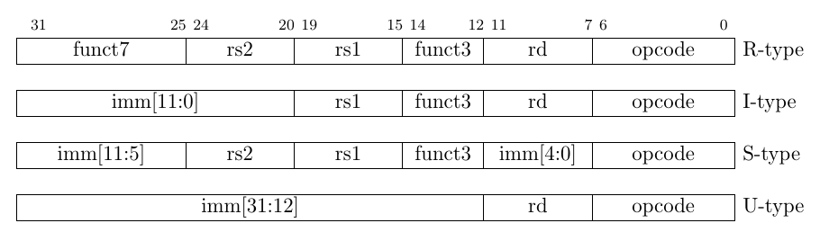
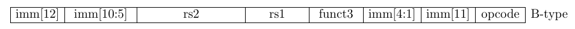
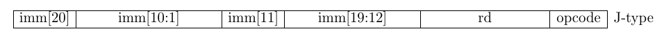

# Parser

The parser, including `parser.cpp` and `parser.hpp`, convert hexadecimal instructions to processable orders.

## Basic Knowledge to RISC-V instructions

### Registers 

Cf. [riscv-asm.md](riscv-asm.md)

### Basic Instruction Formats

Here are the instruction on the RISC-V manual.

Except for the 5-bit immediates used in CSR instructions <a name="rf1">⚓</a>, immediates are always sign-extended, and are generally packed towards the leftmost available bits in the instruction and have been allocated to reduce hardware complexity. In particular, the sign bit for all immediates is always in bit 31 of the instruction to speed sign-extension circuitry.

**立即数的符号拓展**: 摘自Wikipedia.

> **符号扩充**（又名**符号扩展**）是计算机算术中，在保留数字的符号（正负性）及数值的情况下，增加二进制数字位数的操作。此操作根据使用的特定有符号数处理方式，通过在数字的最高有效位端添加位数的方式完成。
>
> 举个例子，若计算机使用六位二进制数表示数字“`00 1010`”（十进制的正10），且此数字需要将字长符号扩充至十六位，则扩充后的值为“`0000 0000 0000 1010`”。此时，数值与符号均保留了下来。
>
> 若计算机使用十位数及二补数表示数字“`11 1111 0001`”（十进制的负15），且此值需要扩充至十六位，则扩充后的值为“`1111 1111 1111 0001`”。 此时，负号及原数字数值通过将左侧填充为1的方式保留了下来。

[Stack Overflow](https://stackoverflow.com/questions/35075976/does-risc-v-mandate-twos-complement-or-ones-complement-signedness-or-is-it-im): In RISC-V negative numbers should be represented with **two's complement**. **补码**

> The RISC-V architecture requires twos-complement integer arithmetic. This can be most directly seen from the fact that it specifies a single addition instruction, not a pair of signed and unsigned addition instructions. In twos-complement arithmetic, signed and unsigned addition are the same operation; in ones-complement (and sign-magnitude) they are not the same.
>
> It appears to me, skimming the architecture manual, that the authors considered the choice of twos-complement integer arithmetic *too obvious to bother mentioning.* There hasn't been a CPU manufactured in at least 25 years that used anything else.

To make it simple, you add ones if the highest digit is 1 (negative) and zeros if the highest digit is 0 (positive).

### Immediate Encoding Variants

B-type instructions have even immediate number, making so `imm[0]` is omitted.

The location of instruction bits in the U and J format immediates is chosen to maximize overlap with the other formats and with each other.

**shamt:** shift amount

[Stack Overflow](https://stackoverflow.com/questions/42298544/what-is-stored-in-the-shift-amount-field-of-r-type-instructions): shamt stands for shift amount which will contain the number by which you want you shift, in `sll $s0,$so,2`, the shamt will be 2 in binary: `00010`

It can (and should be treated) as some special immediate. [REF](#rf1) immediates padding

## Some notes

SLTIU: The immediate is first sign-extended to 32 bits then treated as an unsigned number.

