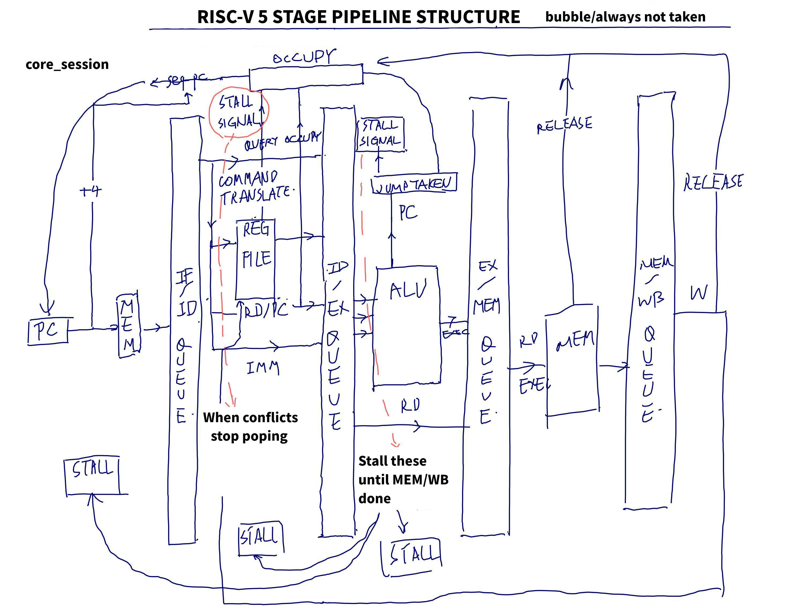

# Running structures

- Sequential

  This simplest sequential structure, implemented in `core.cpp`, the binary code can be get with `make code_seq` in the root folder.

- Pipelined “parallel” action sequence

  **Note**: In this simulated “paralleling” all stages are executed reversely, just like shifting an array. This prevents latter stage wrongly running fresh commands from the previous stage.

  - The simplest pipeline is implemented in `core_pipeline.cpp`. To get this do `make code_pip` in the root folder.

    

    This version uses a bubble/always-taken structure.
    
  - Branch predicting: see [prediction.md](prediction.md)